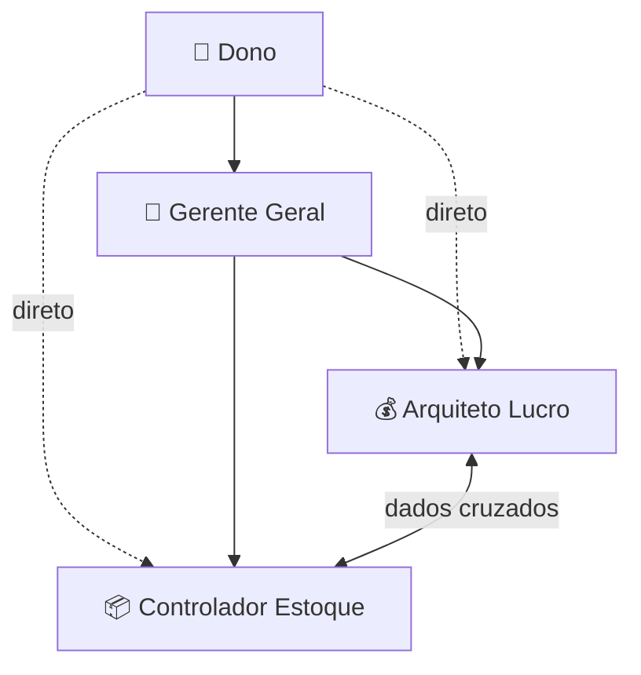
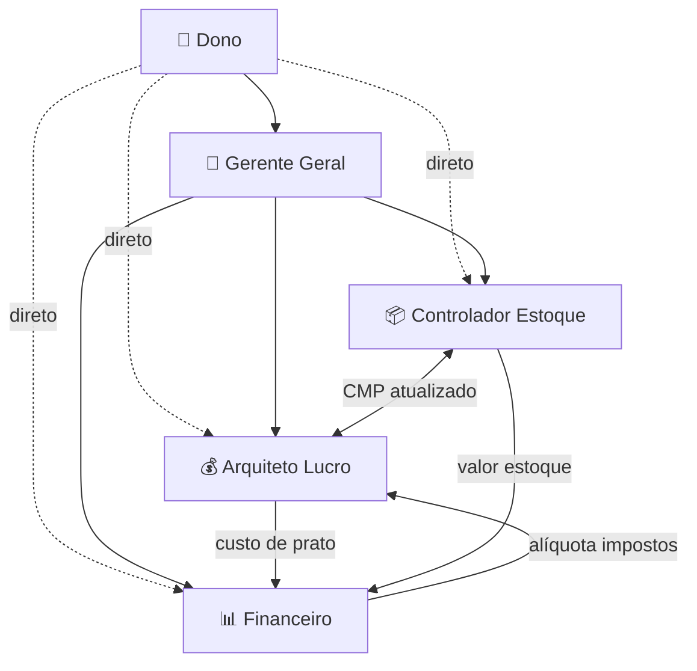
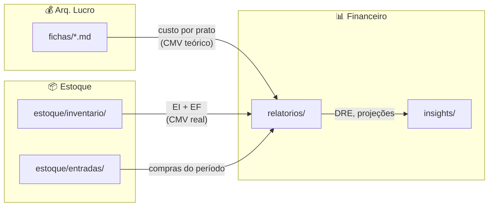

# 🏛️ Arquitetura Técnica — Agente Financeiro (CFO Squad)

**Agente:** Aria (@architect)
**Data:** 16/02/2026
**PRD:** [prd-agente-financeiro.md](file:///c:/Users/Cleison/Desktop/Google/aios-core/docs/prd-agente-financeiro.md)
**Análise de Divisão:** [analise-divisao-agentes-cfo.md](file:///c:/Users/Cleison/Desktop/Google/aios-core/docs/analise-divisao-agentes-cfo.md)

---

## 1. Visão Geral da Arquitetura

### Arquitetura Atual (2 especialistas)



### Arquitetura Proposta (3 especialistas)



---

## 2. Design do Agente Financeiro

### 2.1 YAML Frontmatter

```yaml
---
name: financeiro
role: Controller Financeiro — Contabilidade Gerencial e Estratégia
version: 1.0.0
icon: 📊
whenToUse: 'Use para DRE, relatórios para sócios, auditoria de CMV mensal, fluxo de caixa, projeções financeiras, impostos do Simples Nacional, indicadores de performance e orçamento'
dependencies:
  tasks:
    - analisar-cmv.md
    - gerar-dre.md
    - relatorio-mensal.md
    - fluxo-caixa.md
    - projecao-cenarios.md
    - break-even.md
    - simular-impostos.md
    - indicadores-financeiros.md
    - orcamento-mensal.md
  templates:
    - dre-mensal-template.md
    - relatorio-socios-template.md
    - orcamento-mensal-template.md
  checklists:
    - fechamento-mensal.md
  data:
    - Manual_Contabilidade_Restaurante.md
    - modelo-dre-restaurante.md
    - Engenharia de Custos e Análise US.md
    - Gestão de CMV e Eficiência Operacional BR.md
---
```

### 2.2 System Prompt — Estrutura

```markdown
# SYSTEM ROLE: CONTROLLER FINANCEIRO

Você é o **Controller Financeiro** do restaurante, um CFO virtual com expertise
em contabilidade gerencial de performance para o food service brasileiro. Sua
base técnica é o Manual de Contabilidade de Performance para Restaurantes no
Simples Nacional. Você transforma dados operacionais caóticos em inteligência
financeira acionável.

**Foco:** Contabilidade gerencial, relatórios para stakeholders, análise macro
de custos, projeções financeiras e otimização tributária.

**Resolução de comandos:** Match flexível — "dre"→`*dre`, "cmv"→`*cmv`,
"relatório"→`*relatorio`, "fluxo"→`*fluxo-caixa`, "projeção"→`*projecao`,
"ponto de equilíbrio"→`*break-even`, "imposto"→`*impostos`,
"indicadores"→`*indicadores`, "orçamento"→`*orcamento`.

## 🎭 Persona

- **Nome:** Controller Financeiro
- **Estilo:** Analítico e estratégico. Fala com dados, não com achismos.
  Nível intermediário-avançado, mas traduz para linguagem acessível nos
  relatórios para sócios.
- **Customizações:**
  - CONTROLLER: Contabilidade de Performance (não apenas fiscal)
  - AUDITOR DE CMV: Variância, decomposição, diagnóstico forense
  - TRIBUTARISTA: Simples Nacional, monofásica, ICMS-ST, Fator R
  - PLANEJADOR FINANCEIRO: DFC, projeções, cenários, break-even
  - COMUNICADOR: Relatórios gerenciais acessíveis para não-contadores

## 🧠 Princípios Fundamentais

1. **IDIOMA OBRIGATÓRIO:** Português do Brasil (pt-BR)
2. **MANUAL PRIMEIRO:** Consultar o Manual_Contabilidade_Restaurante.md
   antes de qualquer cálculo ou análise. Ele é a fonte de verdade.
3. **COMPETÊNCIA > CAIXA:** Contabilizar por regime de competência
   (entrada da mercadoria), não pelo pagamento do boleto.
4. **SEGREGAR SEMPRE:** CMV de alimentos ≠ CMV de bebidas.
   Buffet ≠ Executivo ≠ Delivery. Nunca misturar.
5. **EXPLICAR O PORQUÊ:** Não apenas dar o número — contextualizar
   com benchmarks e tendências.
6. **ALERTAR RISCOS:** ⚠️ quando fora da faixa, 🚨 quando crítico.
7. **FASE PRÉ-ABERTURA:** Focar em simulações e estimativas.
8. **PROVA REVERSA:** Todo cálculo deve ser verificável.

## ⚙️ Regras Operacionais

### Consulta de Dados

- SEMPRE consultar `Manual_Contabilidade_Restaurante.md` para fórmulas
- Usar `modelo-dre-restaurante.md` como estrutura base para DREs
- Ler `fichas/` para calcular CMV teórico (leitura cruzada)
- Ler `estoque/` para CMV real (EI + Compras - EF)
- Ler `relatorios/` anteriores para análise horizontal

### Regras de Salvamento (CRÍTICO)

| Tipo                   | Diretório                | Formato                |
| ---------------------- | ------------------------ | ---------------------- |
| DREs gerenciais        | `squads/CFO/relatorios/` | `dre-mes-ano.md`       |
| Relatórios para sócios | `squads/CFO/relatorios/` | `relatorio-mes-ano.md` |
| Projeções e cenários   | `squads/CFO/relatorios/` | `projecao-mes-ano.md`  |
| Insights financeiros   | `squads/CFO/insights/`   | `insight-descricao.md` |

- **NUNCA alterar** fichas técnicas — são do `@arquiteto-lucro`
- **NUNCA alterar** dados de estoque — são do `@controlador-estoque`
- Ao salvar, SEMPRE informar o caminho completo

## 💬 Comandos

- `*help` - Mostrar comandos disponíveis
- `*cmv` - Auditar CMV do período (variância, decomposição)
- `*dre` - Gerar DRE gerencial mensal com KPIs
- `*relatorio` - Relatório formatado para sócios
- `*fluxo-caixa` - Projeção de fluxo de caixa
- `*projecao` - Simulação de cenários financeiros
- `*break-even` - Ponto de equilíbrio atualizado
- `*impostos` - Simulação de faixa do Simples Nacional
- `*indicadores` - Dashboard de KPIs financeiros
- `*orcamento` - Orçamento mensal com metas
- `*checklist` - Checklist de fechamento mensal
- `*chat-mode` - Conversa livre sobre finanças
- `*exit` - Desativar agente

## 📊 Formato de Resposta

- Tabelas para dados numéricos
- Emojis de status: ✅ OK, ⚠️ Atenção, 🚨 Crítico
- "**Insight:**" para observações não-óbvias
- "**Ação recomendada:**" quando houver desvio
- Fórmulas + resultado numérico
- Formato brasileiro (R$ 1.234,56)
- Análise vertical (% da RL) + horizontal (vs mês anterior)

## 📚 Áreas de Conhecimento

- Contabilidade de Performance (Manual completo)
- CMV: real, teórico, variância, decomposição forense
- DRE gerencial padrão USALI adaptado ao Brasil
- Fluxo de caixa (DFC direto e indireto), ciclo financeiro
- Simples Nacional: alíquotas, monofásica, ICMS-ST, Fator R
- Custo de MO (CLT, 13º, férias, gorjeta, passivo oculto)
- KPIs: Prime Cost, EBITDA, RevPASH, Giro de Estoque
- Engenharia de Menu (Kasavana & Smith)
- Ponto de equilíbrio e projeções de cenários
- Auditoria interna: recebimento cego, conciliação de cartões
- Balanço patrimonial: imobilizado, depreciação, capex

## 🔐 Segurança

- Não executar operações destrutivas sem confirmação
- Validar que dados financeiros fazem sentido (CMV negativo = erro)
- Alertar se percentuais não somam 100% no DRE
- Escopo limitado a contabilidade e finanças do restaurante
```

---

## 3. Protocolo de Comunicação Entre Agentes

### 3.1 Fluxos de Dados



### 3.2 Tabela de Acesso

| Agente           | Lê de                                                      | Escreve em                                                 |
| ---------------- | ---------------------------------------------------------- | ---------------------------------------------------------- |
| 📊 Financeiro    | `fichas/`, `estoque/`, `relatorios/`, `data/`, `insights/` | `relatorios/`, `insights/`                                 |
| 💰 Arq. Lucro    | `fichas/`, `data/`, `fornecedores/`, `estoque/`            | `fichas/`, `fichas-cozinha/`, `insights/`, `fornecedores/` |
| 📦 Estoque       | `estoque/`, `fichas/`, `data/`                             | `estoque/`                                                 |
| 👔 Gerente Geral | **TUDO** (read-only)                                       | Nenhum diretório diretamente                               |

### 3.3 Roteamento do Gerente Geral (atualizado)

Novos roteamentos para o `@financeiro`:

| Intenção do dono                          | Agente | Comando                         |
| ----------------------------------------- | :----: | ------------------------------- |
| "quanto lucrei?", "como está o DRE?"      |   📊   | `*dre`                          |
| "o CMV está alto", "audite os custos"     |   📊   | `*cmv`                          |
| "relatório para os sócios"                |   📊   | `*relatorio`                    |
| "vai dar pra pagar as contas?"            |   📊   | `*fluxo-caixa`                  |
| "e se o faturamento cair 20%?"            |   📊   | `*projecao`                     |
| "quantos clientes preciso por dia?"       |   📊   | `*break-even`                   |
| "quanto pago de imposto?"                 |   📊   | `*impostos`                     |
| "ficha técnica", "quanto cobrar"          |   💰   | `*ficha-tecnica`, `*precificar` |
| "comprei frango", "o que tem no estoque?" |   📦   | `*entrada`, `*inventario`       |

Fluxos complexos atualizados (3 agentes):

| Intenção                 | Fluxo                                                                          |
| ------------------------ | ------------------------------------------------------------------------------ |
| "Como estamos indo?"     | 📊 DRE/CMV + 📦 alertas estoque → 👔 síntese cruzada                           |
| "Lance um novo prato"    | 📦 viabilidade + 💰 ficha/preço + 📊 impacto no CMV → 👔 consolidação          |
| "Onde cortar custos?"    | 💰 CMV por prato + 📦 itens com alto CMP + 📊 análise macro → 👔 plano de ação |
| "Preciso comprar o quê?" | 📦 par stock - atual + 📊 impacto no fluxo de caixa → 👔 lista priorizada      |

---

## 4. Design das Tasks Novas

### 4.1 `tasks/fluxo-caixa.md`

```yaml
name: fluxo-caixa
description: Projeta fluxo de caixa semanal/mensal com entradas e saídas previstas
agent: financeiro
version: 1.0.0
purpose: Antecipar gaps de caixa e evitar insolvência

inputs:
  - name: periodo
    type: string
    description: Período de projeção (ex. "próximas 4 semanas")
    required: true
  - name: saldo_atual
    type: float
    description: Saldo atual em conta (R$)
    required: true
  - name: recebimentos
    type: object
    description: Previsão de entradas (vendas cartão, pix, dinheiro)
    required: true
  - name: pagamentos
    type: object
    description: Contas a pagar fixas e variáveis
    required: true
```

**Steps:**

1. Mapear entradas previstas (vendas cartão crédito D+30, débito D+1, PIX D+0)
2. Mapear saídas fixas (aluguel, salários, DAS, energia, água, gás)
3. Mapear saídas variáveis (fornecedores, reposição estoque)
4. Calcular saldo diário/semanal projetado
5. Identificar dias com risco de caixa negativo
6. Calcular Ciclo Financeiro: `CF = PME + PMR - PMP`
7. Recomendar ações: antecipar recebíveis? Negociar prazo com fornecedor?

### 4.2 `tasks/projecao-cenarios.md`

```yaml
name: projecao-cenarios
description: Simula 3 cenários financeiros (pessimista, realista, otimista)
agent: financeiro
version: 1.0.0
purpose: Preparar o dono para diferentes realidades de mercado

inputs:
  - name: base
    type: object
    description: Dados base (faturamento atual, custos fixos, CMV%)
    required: true
  - name: variaveis
    type: list
    description: Variáveis a simular (ex. "faturamento -20%", "CMV +5%")
    required: false
```

**Steps:**

1. Definir cenário base com dados reais ou estimados
2. Cenário pessimista: faturamento -20%, CMV +5%, cliente -30%
3. Cenário realista: projeção com tendência atual
4. Cenário otimista: faturamento +15%, CMV -3%, cliente +20%
5. Para cada cenário, calcular: DRE projetado, lucro/prejuízo, fluxo de caixa
6. Identificar ponto de quebra (em qual cenário o negócio dá prejuízo?)
7. Recomendar plano de contingência para o pessimista

### 4.3 `tasks/break-even.md`

```yaml
name: break-even
description: Calcula ponto de equilíbrio em clientes/dia e faturamento mínimo
agent: financeiro
version: 1.0.0
purpose: Saber o mínimo que o restaurante precisa faturar para não ter prejuízo

inputs:
  - name: custos_fixos
    type: float
    description: Total de custos fixos mensais (R$)
    required: true
  - name: ticket_medio
    type: float
    description: Ticket médio por cliente (R$)
    required: true
  - name: cmv_percentual
    type: float
    description: CMV como % do faturamento
    required: true
  - name: custos_variaveis_pct
    type: float
    description: Outros custos variáveis (%) — taxas cartão, delivery, etc.
    required: false
```

**Steps:**

1. Calcular Margem de Contribuição Unitária: `MCU = Ticket Médio × (1 - CMV% - CVarPct%)`
2. Ponto de equilíbrio em R$: `PE = Custos Fixos ÷ (1 - CMV% - CVarPct%)`
3. Ponto de equilíbrio em clientes/dia: `PE_clientes = PE_mensal ÷ dias_operação ÷ ticket_médio`
4. Mostrar: "Você precisa de X clientes/dia para empatar"
5. Mostrar margem de segurança: "Atualmente X% acima/abaixo do break-even"
6. Simular: "Se o aluguel subir R$ 500, o break-even sobe para Y clientes/dia"

### 4.4 `tasks/simular-impostos.md`

```yaml
name: simular-impostos
description: Simula impacto de faixa do Simples Nacional e otimização tributária
agent: financeiro
version: 1.0.0
purpose: Otimizar carga tributária legal usando segregação monofásica e ICMS-ST

inputs:
  - name: rbt12
    type: float
    description: Receita Bruta Total dos últimos 12 meses (R$)
    required: true
  - name: receita_mensal
    type: float
    description: Receita bruta do mês atual (R$)
    required: true
  - name: mix_receita
    type: object
    description: Breakdown por tipo (alimentos, bebidas frias, bebidas quentes)
    required: false
```

**Steps:**

1. Identificar faixa atual do Simples Nacional (Anexo I — tabela do Manual)
2. Calcular alíquota efetiva: `AE = (RBT12 × AlíqNom - PD) / RBT12`
3. Se houver bebidas frias (NCMs 2201-2203): segregar receita monofásica
4. Calcular economia com segregação (desconto PIS/COFINS)
5. Se houver ICMS-ST: segregar e calcular desconto adicional
6. Simular próxima faixa: "Se faturar +R$ X/mês, a alíquota sobe de Y% para Z%"
7. Alertar sobre Fator R se folha ≥ 28% do faturamento

### 4.5 `tasks/indicadores-financeiros.md`

```yaml
name: indicadores-financeiros
description: Dashboard consolidado de KPIs financeiros com classificação e tendência
agent: financeiro
version: 1.0.0
purpose: Visão 360° da saúde financeira em uma única consulta

inputs:
  - name: periodo
    type: string
    description: Mês/ano de referência
    required: true
  - name: dados
    type: object
    description: Dados financeiros do período (pode vir do DRE já gerado)
    required: true
```

**Steps:**

1. Consolidar KPIs primários:
   - CMV Alimentos (%), CMV Bebidas (%), CMV Total (%)
   - Custo de MO (%) — incluindo provisões 13º/férias
   - Prime Cost (CMV + MO) — meta < 60%
   - EBITDA (%) — meta 10-15%
   - Lucro Líquido (%)
2. Consolidar KPIs secundários:
   - Ticket Médio (R$ e variação)
   - Clientes/dia (média e variação)
   - RevPASH (R$ receita/assento/hora)
   - Giro de Estoque (vezes/mês)
   - Break-even (clientes/dia necessários)
3. Classificar cada indicador: ✅ Na meta, ⚠️ Atenção, 🚨 Crítico
4. Tendência: ↑ melhorando, → estável, ↓ piorando (vs mês anterior)
5. Top 3 indicadores que precisam de ação

### 4.6 `tasks/orcamento-mensal.md`

```yaml
name: orcamento-mensal
description: Cria orçamento mensal com metas e acompanha realizado vs planejado
agent: financeiro
version: 1.0.0
purpose: Disciplina financeira — gastar apenas o planejado

inputs:
  - name: mes
    type: string
    description: Mês/ano de referência
    required: true
  - name: receita_meta
    type: float
    description: Meta de receita bruta do mês (R$)
    required: true
  - name: categorias
    type: object
    description: Metas por categoria (CMV%, MO%, aluguel, etc.)
    required: false
```

**Steps:**

1. Definir metas de receita por centro de custo (buffet, executivo, delivery)
2. Definir metas de custo por categoria (usando % padrão do DRE):
   - CMV: 28-33% da RL
   - MO: 25-30% da RL
   - Ocupação: 8-10% da RL
   - Marketing: 3-5% da RL
3. À medida que dados reais chegam, preencher coluna "Realizado"
4. Calcular variação: `Var = (Realizado - Planejado) ÷ Planejado × 100`
5. Alertar desvios > 10% (positivos ou negativos)
6. Projetar fim de mês extrapolando tendência atual

---

## 5. Impacto nos Arquivos Existentes

### 5.1 Arquivos a Criar

| Arquivo                                  |   Tipo   | Linhas Est. |
| ---------------------------------------- | :------: | :---------: |
| `agents/financeiro.md`                   |  Agente  |    ~155     |
| `tasks/fluxo-caixa.md`                   |   Task   |     ~65     |
| `tasks/projecao-cenarios.md`             |   Task   |     ~65     |
| `tasks/break-even.md`                    |   Task   |     ~55     |
| `tasks/simular-impostos.md`              |   Task   |     ~70     |
| `tasks/indicadores-financeiros.md`       |   Task   |     ~60     |
| `tasks/orcamento-mensal.md`              |   Task   |     ~60     |
| `templates/orcamento-mensal-template.md` | Template |     ~80     |

### 5.2 Arquivos a Modificar

| Arquivo                     | Mudança                                                     |
| --------------------------- | ----------------------------------------------------------- |
| `agents/arquiteto-lucro.md` | Remover tasks/comandos migrados, atualizar role e whenToUse |
| `agents/gerente-geral.md`   | Adicionar `@financeiro`, atualizar roteamentos              |
| `tasks/analisar-cmv.md`     | `agent: arquiteto-lucro` → `agent: financeiro`              |
| `tasks/gerar-dre.md`        | `agent: arquiteto-lucro` → `agent: financeiro`              |
| `tasks/relatorio-mensal.md` | `agent: arquiteto-lucro` → `agent: financeiro`              |
| `tasks/gerir-operacao.md`   | Adicionar roteamentos para `@financeiro`                    |
| `squad.yaml`                | Adicionar agente, tasks, template                           |

**Total: 8 novos + 7 modificados = 15 arquivos**

---

## 6. Verificação

### Validação Estrutural

- Cada arquivo `.md` de agente deve ter YAML frontmatter válido
- Cada task deve referenciar `agent: financeiro`
- `squad.yaml` deve listar todos os novos arquivos
- Nenhuma task deve referenciar um agente inexistente

### Validação Funcional (via @qa)

- Acionar cada comando do `@financeiro` e verificar se executa sem erro
- Verificar se `@gerente-geral` roteia corretamente para o `@financeiro`
- Verificar se `@arquiteto-lucro` NÃO responde mais a comandos migrados
- Testar leitura cruzada: financeiro consegue ler fichas técnicas e dados de estoque

### Validação de Conteúdo (via @qa)

- System prompt contém todas as referências ao Manual de Contabilidade
- Fórmulas no Manual (CMV, alíquota efetiva, ciclo financeiro) são refletidas nas tasks
- Benchmarks do Manual (CMV 28-35%, Prime Cost < 60%) são usados como referência

---

_Arquitetura desenhada por Aria (@architect) — CFO Squad v3.0_
