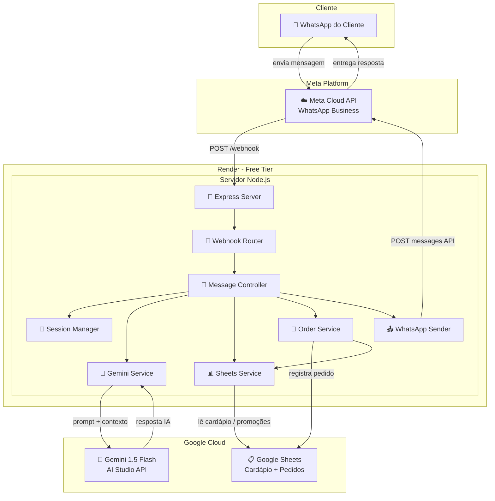
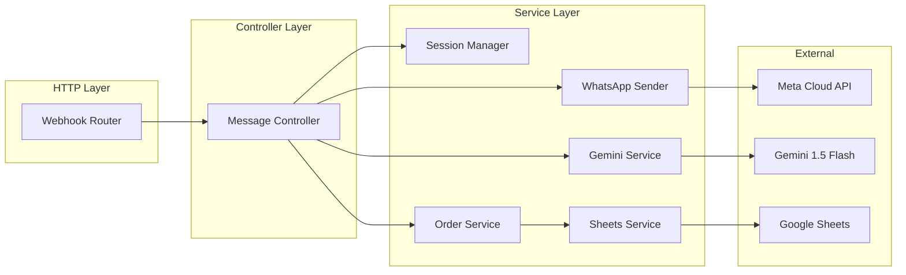
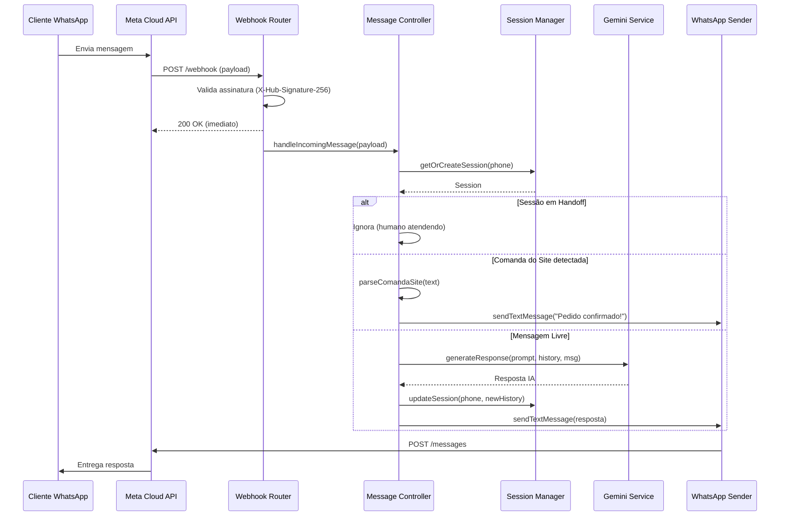
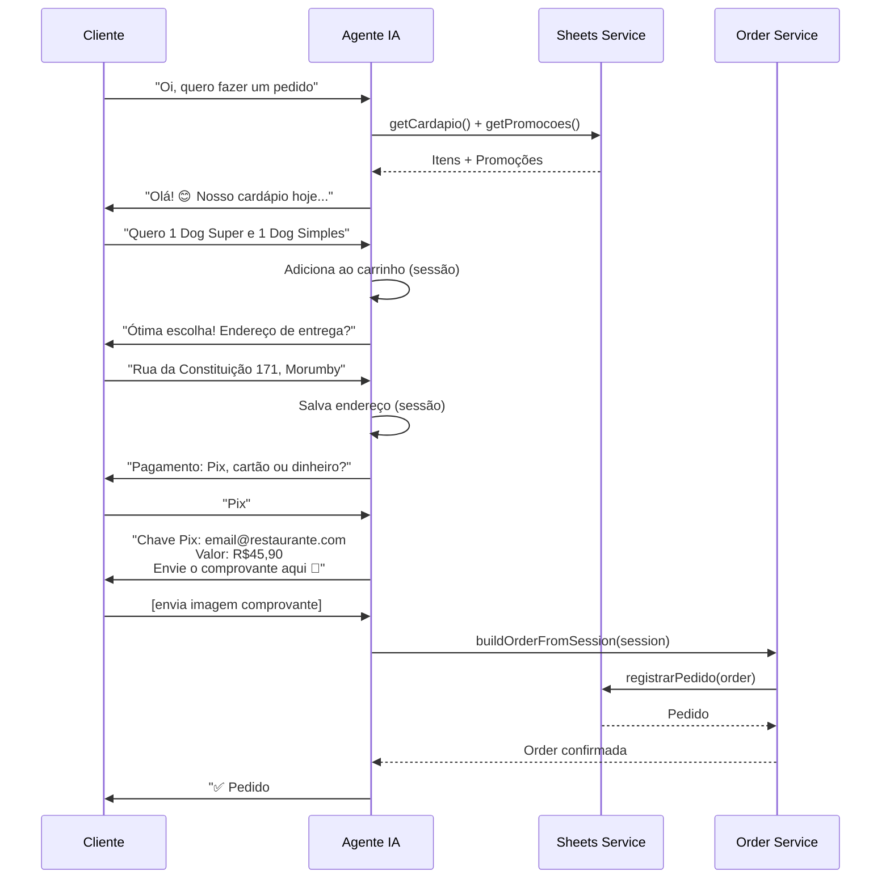

# Agente Atendente IA WhatsApp — Architecture Document

**Projeto:** Squad CFO — Atendente IA WhatsApp
**Versão:** 1.0
**Data:** 2026-03-06
**Autor:** @architect (Aria)
**PRD Ref:** `squads/CFO/docs/prd-agente-atendente-whatsapp.md`
**Status:** Draft — Aguardando Aprovação

---

## 1. Introduction

Este documento define a arquitetura técnica completa do Agente Atendente IA WhatsApp, um servidor Node.js/TypeScript que opera 24/7 como webhook da API Oficial do WhatsApp (Meta), utilizando Gemini 1.5 Flash como motor de IA e Google Sheets como banco de dados do MVP.

**Starter Template:** N/A — Projeto criado do zero com Express + TypeScript.

### Change Log

| Data | Versão | Descrição | Autor |
|------|--------|-----------|-------|
| 2026-03-06 | 1.0 | Criação inicial da arquitetura | @architect (Aria) |

---

## 2. High Level Architecture

### 2.1 Technical Summary

O sistema segue uma **arquitetura monolítica modular** dentro do monorepo `aios-core`, organizada em camadas claras (routes → controllers → services). O servidor Express recebe webhooks da Meta, processa as mensagens usando Gemini 1.5 Flash como motor conversacional, consulta e escreve dados no Google Sheets, e responde ao cliente via API da Meta. O gerenciamento de estado de conversa opera em memória por número de telefone, com timeout configurável.

### 2.2 High Level Overview

1. **Estilo Arquitetural:** Monolito Modular — único serviço Node.js com separação de responsabilidades via módulos
2. **Repositório:** Monorepo (dentro de `aios-core/squads/CFO/atendente-whatsapp/`)
3. **Arquitetura de Serviço:** Servidor HTTP contínuo (Express) recebendo webhooks e processando assincronamente
4. **Fluxo Principal:** Webhook HTTP → Roteamento → Processamento IA → Resposta WhatsApp
5. **Decisão-chave:** Manter simples para MVP — sem filas, sem microserviços, sem banco relacional

### 2.3 High Level Project Diagram



### 2.4 Architectural and Design Patterns

- **Modular Monolith:** Separação em módulos (routes, controllers, services) com interfaces claras — _Rationale:_ Simplicidade de deploy e debug para MVP, fácil evolução para microserviços se necessário
- **Controller-Service Pattern:** Controllers lidam com HTTP, Services contêm lógica de negócio — _Rationale:_ Separação de responsabilidades, testabilidade dos services isolada do HTTP
- **In-Memory Session Map:** Sessões de conversa em `Map<string, Session>` indexadas por telefone — _Rationale:_ Zero dependência externa, latência mínima. Adequado para MVP (estado se perde em restart, aceitável)
- **Cache com TTL:** Dados do Google Sheets cacheados em memória com TTL de 15 minutos — _Rationale:_ Reduz chamadas à API do Sheets, respeita rate limits, dados do cardápio não mudam frequentemente
- **Async Webhook Processing:** Resposta `200 OK` imediata à Meta, processamento assíncrono — _Rationale:_ Meta exige resposta rápida (timeout de 5s); processamento IA pode demorar mais

---

## 3. Tech Stack

### 3.1 Cloud Infrastructure

- **Provider:** Render (free tier para MVP)
- **Key Services:** Web Service (Node.js), auto-deploy via Git
- **Região:** US (Oregon — padrão Render free)

### 3.2 Technology Stack Table

| Categoria | Tecnologia | Versão | Propósito | Justificativa |
|-----------|-----------|--------|-----------|---------------|
| **Linguagem** | TypeScript | 5.4+ | Linguagem principal | Tipagem forte, melhor DX, alinhado com padrões AIOS |
| **Runtime** | Node.js | 20 LTS | Runtime JavaScript | LTS estável, suporte nativo ESM, performance |
| **Framework HTTP** | Express | 4.18+ | Servidor HTTP/Webhook | Maduro, documentação vasta, simples para MVP |
| **SDK IA** | @google/generative-ai | latest | Integração Gemini 1.5 Flash | SDK oficial Google para AI Studio |
| **Google Sheets** | googleapis | 130+ | Leitura/escrita no Sheets | SDK oficial Google, bem documentado |
| **Validação** | zod | 3.22+ | Validação de inputs | Leve, TypeScript-first, schemas reutilizáveis |
| **Ambiente** | dotenv | 16+ | Variáveis de ambiente | Padrão da indústria para configuração |
| **Logging** | pino | 8+ | Logs estruturados | Extremamente rápido, JSON nativo, baixo overhead |
| **HTTP Client** | node-fetch (built-in) | — | Chamadas à Meta API | Nativo no Node.js 20+, sem dependência extra |
| **Linter** | ESLint | 8+ | Qualidade de código | Padrão AIOS |
| **Formatter** | Prettier | 3+ | Formatação consistente | Padrão AIOS |
| **Test Framework** | Vitest | 1+ | Testes unitários/integração | Rápido, TypeScript nativo, compatível com Jest API |
| **Build** | tsx + tsc | — | Dev/Build | tsx para dev (hot reload), tsc para produção |

---

## 4. Data Models

### 4.1 Session (Sessão de Conversa)

**Propósito:** Mantém o estado de cada conversa ativa, indexada pelo número de telefone do cliente.

**Key Attributes:**
- `phoneNumber`: string — Número do cliente (chave primária)
- `messageHistory`: Array<{role, content}> — Últimas 20 mensagens para contexto do Gemini
- `cart`: CartItem[] — Itens no carrinho do pedido atual
- `deliveryAddress`: string | null — Endereço coletado
- `paymentMethod`: string | null — Forma de pagamento escolhida
- `state`: enum — Estado da conversa (IDLE, ORDERING, AWAITING_ADDRESS, AWAITING_PAYMENT, AWAITING_PIX_PROOF, CONFIRMED, HANDOFF)
- `lastActivity`: Date — Timestamp da última interação
- `isHandoff`: boolean — Se o bot está pausado para este número

### 4.2 MenuItem (Item do Cardápio)

**Propósito:** Representação de um item do cardápio lido do Google Sheets.

**Key Attributes:**
- `name`: string — Nome do prato
- `description`: string — Descrição
- `price`: number — Preço em R$
- `category`: string — Categoria (ex: "Hot Dogs", "Porções", "Bebidas")
- `available`: boolean — Se está disponível
- `options`: Option[] — Opcionais/adicionais

### 4.3 Order (Pedido)

**Propósito:** Pedido finalizado que será registrado no Google Sheets.

**Key Attributes:**
- `orderNumber`: number — Número sequencial
- `createdAt`: Date — Data/hora do pedido
- `customerName`: string — Nome do cliente
- `customerPhone`: string — Telefone
- `deliveryAddress`: string — Endereço completo
- `items`: OrderItem[] — Lista de itens com quantidades e preços
- `subtotal`: number — Subtotal
- `deliveryFee`: number — Taxa de entrega
- `total`: number — Valor final
- `paymentMethod`: string — Forma de pagamento
- `paymentDetails`: string — Detalhes (troco, bandeira, etc.)
- `status`: string — "Em Preparo" | "Entregue" | "Cancelado"
- `source`: string — "site" | "whatsapp"
- `estimatedDelivery`: string — Prazo estimado

---

## 5. Components

### 5.1 Webhook Router (`src/routes/webhook.ts`)

**Responsabilidade:** Receber e validar requisições HTTP da Meta (GET para verificação, POST para mensagens).

**Interfaces:**
- `GET /webhook` — Verificação do webhook (Meta challenge)
- `POST /webhook` — Recepção de mensagens
- `GET /health` — Health check

**Dependências:** MessageController

### 5.2 Message Controller (`src/controllers/message.controller.ts`)

**Responsabilidade:** Orquestrar o processamento de uma mensagem recebida: classificar tipo, decidir fluxo, e coordenar services.

**Interfaces:**
- `handleIncomingMessage(webhookPayload)` — Ponto de entrada principal
- `detectMessageType(text)` — Determina: comanda do site, mensagem livre, ou mídia

**Dependências:** GeminiService, SessionManager, OrderService, WhatsAppSender

### 5.3 Gemini Service (`src/services/gemini.service.ts`)

**Responsabilidade:** Interface com a API do Gemini 1.5 Flash. Monta o prompt com persona + cardápio + histórico e envia para o modelo.

**Interfaces:**
- `generateResponse(systemPrompt, messageHistory, userMessage)` → string
- `buildSystemPrompt(cardapio, promocoes, sessionState)` → string

**Dependências:** @google/generative-ai SDK

### 5.4 Session Manager (`src/services/session.manager.ts`)

**Responsabilidade:** Gerenciar sessões de conversa por número de telefone. CRUD de sessões, timeout, e limpeza.

**Interfaces:**
- `getOrCreateSession(phoneNumber)` → Session
- `updateSession(phoneNumber, updates)` → void
- `clearExpiredSessions()` → void
- `setHandoff(phoneNumber, active)` → void
- `isHandoff(phoneNumber)` → boolean

**Dependências:** Nenhuma (in-memory Map)

### 5.5 WhatsApp Sender (`src/services/whatsapp.sender.ts`)

**Responsabilidade:** Enviar mensagens de resposta ao cliente via Meta Cloud API.

**Interfaces:**
- `sendTextMessage(to, text)` → void
- `sendImageMessage(to, imageUrl)` → void (futuro: QR Pix)
- `markAsRead(messageId)` → void

**Dependências:** Meta Cloud API (HTTP POST)

### 5.6 Sheets Service (`src/services/sheets.service.ts`)

**Responsabilidade:** Ler e escrever dados no Google Sheets (cardápio, promoções, pedidos).

**Interfaces:**
- `getCardapio()` → MenuItem[] (com cache de 15min)
- `getPromocoes()` → Promocao[]
- `registrarPedido(order)` → number (retorna nº do pedido)
- `getNextOrderNumber()` → number

**Dependências:** googleapis SDK, Google Service Account

### 5.7 Order Service (`src/services/order.service.ts`)

**Responsabilidade:** Lógica de negócio para montagem e finalização de pedidos.

**Interfaces:**
- `parseComandaSite(text)` → Order (parser do Modo Confirmador)
- `buildOrderFromSession(session)` → Order (Modo Consultivo)
- `formatOrderConfirmation(order)` → string (formato comanda padrão)
- `calculateTotal(items, deliveryFee)` → number

**Dependências:** SheetsService

### 5.8 Component Diagram



---

## 6. External APIs

### 6.1 Meta WhatsApp Cloud API

- **Propósito:** Receber e enviar mensagens do WhatsApp
- **Documentação:** https://developers.facebook.com/docs/whatsapp/cloud-api
- **Base URL:** `https://graph.facebook.com/v21.0`
- **Autenticação:** Bearer Token (System User Token permanente)
- **Rate Limits:** 250 mensagens/segundo (mais do que suficiente), 1.000 conversas inbound/mês grátis

**Key Endpoints:**
- `POST /{PHONE_NUMBER_ID}/messages` — Enviar mensagem
- `GET /webhook` — Verificação de webhook (challenge)
- `POST /webhook` — Receber mensagens (webhook events)

**Integration Notes:** O token tem que ser do tipo "System User" para não expirar. O PHONE_NUMBER_ID é o ID interno do número, não o número em si. A assinatura X-Hub-Signature-256 deve ser validada em cada request.

### 6.2 Google AI Studio (Gemini API)

- **Propósito:** Geração de respostas de IA conversacional
- **Documentação:** https://ai.google.dev/gemini-api/docs
- **Base URL:** Via SDK `@google/generative-ai`
- **Autenticação:** API Key
- **Rate Limits:** Free: 15 RPM / 1M TPM; Pay-as-you-go: 2000 RPM

**Key Endpoints (via SDK):**
- `model.generateContent(prompt)` — Gerar resposta de texto
- `model.startChat(config)` — Iniciar sessão de chat com contexto

**Integration Notes:** Usar `gemini-1.5-flash` como modelo. Temperature 0.3. Safety settings `BLOCK_NONE` para garantir respostas sobre comida sem bloqueios falsos. System instruction com persona completa.

### 6.3 Google Sheets API

- **Propósito:** CRUD de dados (cardápio, promoções, pedidos)
- **Documentação:** https://developers.google.com/sheets/api
- **Base URL:** Via SDK `googleapis`
- **Autenticação:** Service Account (JSON key file)
- **Rate Limits:** 60 requests/minuto por projeto

**Key Endpoints (via SDK):**
- `sheets.spreadsheets.values.get()` — Ler dados de uma aba
- `sheets.spreadsheets.values.append()` — Adicionar linha (registro de pedido)
- `sheets.spreadsheets.values.update()` — Atualizar célula

**Integration Notes:** O Service Account precisa ter acesso de "Editor" na planilha. Cache de 15 min no cardápio. A planilha terá 3 abas: "Cardápio", "Promoções", "Pedidos".

---

## 7. Core Workflows

### 7.1 Fluxo: Recepção de Mensagem (Principal)



### 7.2 Fluxo: Pedido Completo (Modo Consultivo)



---

## 8. Source Tree

```
squads/CFO/atendente-whatsapp/
├── src/
│   ├── config/
│   │   ├── env.ts                    # Carrega e valida variáveis de ambiente
│   │   └── constants.ts              # Constantes (timeouts, limites, etc.)
│   ├── controllers/
│   │   └── message.controller.ts     # Orquestração do processamento de mensagens
│   ├── routes/
│   │   ├── webhook.ts                # GET/POST /webhook + GET /health
│   │   └── admin.ts                  # (futuro) Endpoints administrativos
│   ├── services/
│   │   ├── gemini.service.ts         # Integração c/ Gemini 1.5 Flash
│   │   ├── session.manager.ts        # Sessões em memória por telefone
│   │   ├── whatsapp.sender.ts        # Envio de mensagens via Meta API
│   │   ├── sheets.service.ts         # Leitura/escrita Google Sheets
│   │   └── order.service.ts          # Lógica de pedidos + parser de comanda
│   ├── prompts/
│   │   └── atendente.prompt.ts       # System prompt da persona atendente
│   ├── types/
│   │   ├── session.types.ts          # Tipos: Session, CartItem, SessionState
│   │   ├── order.types.ts            # Tipos: Order, OrderItem, MenuItem
│   │   ├── whatsapp.types.ts         # Tipos: WebhookPayload, MessageEvent
│   │   └── sheets.types.ts           # Tipos: SheetRow, CardapioRow
│   ├── utils/
│   │   ├── logger.ts                 # Wrapper do pino
│   │   ├── signature.ts              # Validação X-Hub-Signature-256
│   │   └── formatter.ts              # Formatação de comanda, valores R$
│   ├── app.ts                        # Setup Express + middlewares
│   └── server.ts                     # Entry point (listen)
├── tests/
│   ├── unit/
│   │   ├── order.service.test.ts
│   │   ├── session.manager.test.ts
│   │   ├── message.controller.test.ts
│   │   └── signature.test.ts
│   ├── integration/
│   │   ├── webhook.test.ts
│   │   └── sheets.service.test.ts
│   └── fixtures/
│       ├── webhook-payloads.ts       # Payloads de teste da Meta
│       └── comanda-samples.ts        # Exemplos de comandas do site
├── .env.example                      # Template de variáveis de ambiente
├── .eslintrc.json
├── .prettierrc
├── Dockerfile                        # Para deploy no Render
├── package.json
├── tsconfig.json
├── vitest.config.ts
└── README.md                         # Documentação de setup e operação
```

---

## 9. Infrastructure and Deployment

### 9.1 Infrastructure

- **Plataforma:** Render (Web Service — free tier)
- **Build Command:** `npm run build` (tsc)
- **Start Command:** `npm start` (node dist/server.js)
- **Auto-deploy:** A partir do branch `feat/atendente-whatsapp` via Git push

### 9.2 Deployment Strategy

- **Estratégia:** Git push → auto-deploy no Render
- **CI/CD:** Render integrado com GitHub (automático)
- **Pipeline:** `git push origin feat/atendente-whatsapp` → Render detecta → build → deploy

### 9.3 Environments

- **Development:** Local (`npm run dev` com tsx para hot reload)
- **Staging:** Render free tier (URL de teste)
- **Production:** Render (mesmo, após validação com número de teste Meta)

### 9.4 Variáveis de Ambiente

```env
# Meta WhatsApp
META_VERIFY_TOKEN=token_de_verificacao_custom
META_ACCESS_TOKEN=token_do_system_user_meta
META_PHONE_NUMBER_ID=id_do_numero_meta
META_APP_SECRET=secret_da_app_meta

# Google AI Studio
GEMINI_API_KEY=key_do_google_ai_studio

# Google Sheets
GOOGLE_SHEETS_CREDENTIALS=json_base64_service_account
SHEETS_CARDAPIO_ID=id_da_planilha
SHEETS_PEDIDOS_ID=id_da_planilha_pedidos

# Pagamento
PIX_KEY=chave_pix_do_restaurante
PIX_RECEIVER_NAME=Nome_do_Recebedor

# Configuração
SESSION_TIMEOUT_MINUTES=30
CARDAPIO_CACHE_MINUTES=15
ESTIMATED_DELIVERY_MINUTES=50
PORT=3000
NODE_ENV=production
```

### 9.5 Rollback Strategy

- **Método:** Rollback via Render dashboard (deploy anterior)
- **Trigger:** Falha no health check ou erros de webhook
- **RTO:** < 2 minutos

---

## 10. Error Handling Strategy

### 10.1 General Approach

- **Modelo de Erros:** Custom Error classes com codes tipados
- **Hierarquia:** `AppError` (base) → `WhatsAppError`, `GeminiError`, `SheetsError`
- **Propagação:** Try/catch em cada service, log + fallback message ao cliente

### 10.2 Logging Standards

- **Biblioteca:** pino v8+
- **Formato:** JSON estruturado
- **Níveis:** `error` (falhas), `warn` (degradação), `info` (operações normais), `debug` (dev only)
- **Contexto obrigatório:** `{ phoneNumber, messageId, service, action }`
- **Segurança:** NUNCA logar conteúdo de mensagens do cliente, tokens, ou chaves

### 10.3 Error Handling Patterns

**External API Errors (Meta / Gemini / Sheets):**
- Retry: até 3 tentativas com backoff exponencial (1s, 2s, 4s)
- Timeout: Meta API 10s, Gemini API 15s, Sheets API 10s
- Fallback: Se Gemini falhar, enviar mensagem genérica ao cliente: "Estamos com instabilidade, tente novamente em 1 minuto 🙏"

**Business Logic Errors:**
- Carrrinho vazio na confirmação → "Parece que seu carrinho está vazio. Quer ver o cardápio?"
- Item indisponível → "Esse item não está disponível no momento. Posso sugerir outra opção?"
- Erro no formato do endereço → Pedir novamente de forma educada

---

## 11. Coding Standards

### 11.1 Core Standards

- **Linguagem:** TypeScript 5.4+ (strict mode)
- **Linter:** ESLint com regras padrão AIOS
- **Formatter:** Prettier
- **Testes:** `*.test.ts` colocalizados em `tests/unit/` e `tests/integration/`

### 11.2 Naming Conventions

| Elemento | Convenção | Exemplo |
|----------|-----------|---------|
| Arquivos | kebab-case | `gemini.service.ts` |
| Classes | PascalCase | `SessionManager` |
| Funções | camelCase | `getOrCreateSession()` |
| Constantes | SCREAMING_SNAKE | `SESSION_TIMEOUT_MINUTES` |
| Interfaces/Types | PascalCase | `WebhookPayload`, `SessionState` |
| Enum values | SCREAMING_SNAKE | `AWAITING_PAYMENT` |

### 11.3 Critical Rules

- **Sem `any`:** Usar tipos explícitos ou `unknown` com type guards
- **Sem `console.log`:** Usar o logger (pino) em todos os casos
- **Imports absolutos:** Usar path aliases configurados no tsconfig (`@/services/...`)
- **Secrets seguros:** NUNCA hardcode tokens — sempre via `process.env`
- **Async/await:** Todo I/O deve ser async, sem callbacks
- **Validação na borda:** Todo input do webhook deve ser validado com zod antes de processar

---

## 12. Test Strategy

### 12.1 Testing Philosophy

- **Abordagem:** Test-after (implementar + testar em cada story)
- **Cobertura alvo:** ≥70% para services, 100% para utils/parsers
- **Pirâmide:** Muitos unit tests, poucos integration, manual E2E

### 12.2 Test Types

**Unit Tests (Vitest):**
- `order.service.test.ts` — Parser de comanda, cálculo de totais, formatação
- `session.manager.test.ts` — CRUD de sessões, timeout, handoff
- `message.controller.test.ts` — Classificação de mensagem, roteamento
- `signature.test.ts` — Validação de assinatura Meta

**Integration Tests (Vitest):**
- `webhook.test.ts` — Fluxo completo: payload → processamento → resposta (mocking APIs externas)
- `sheets.service.test.ts` — Leitura/escrita com mock do googleapis

**E2E / Manual:**
- Teste com número sandbox da Meta
- Simular fluxo completo: cliente pedindo pelo WhatsApp
- Simular comanda do site

### 12.3 Test Data

- **Fixtures:** Payloads de webhook reais da Meta (anonimizados), comandas de exemplo
- **Location:** `tests/fixtures/`

---

## 13. Security

### 13.1 Input Validation

- **Biblioteca:** zod
- **Local:** Na entrada do webhook (antes de processar)
- **Regras:** Validar estrutura do payload Meta, sanitizar texto de mensagens

### 13.2 Authentication & Authorization

- **Webhook Meta:** Verificação de token (GET) + validação de assinatura HMAC-SHA256 (POST)
- **Google Sheets:** Service Account com escopo mínimo (`spreadsheets`)
- **Gemini:** API Key via variável de ambiente

### 13.3 Secrets Management

- **Desenvolvimento:** Arquivo `.env` local (gitignored)
- **Produção:** Render Environment Variables (encriptadas)
- **Regras:** NUNCA commitar `.env`, credenciais JSON como base64 na env var

### 13.4 API Security

- **HTTPS:** Obrigatório (Render fornece SSL automaticamente)
- **Rate Limiting:** Não necessário no MVP (Meta já controla o tráfego do webhook)
- **CORS:** Desabilitado (servidor não serve frontend)

### 13.5 Data Protection

- **PII:** Nome, telefone e endereço do cliente armazenados apenas no Google Sheets
- **Logs:** NUNCA logar conteúdo das mensagens do cliente
- **Sessões:** Limpas automaticamente após timeout (dados efêmeros)

---

## 14. Next Steps

### PO Prompt

> @po (Pax): Usando o PRD (`squads/CFO/docs/prd-agente-atendente-whatsapp.md`) e esta arquitetura (`squads/CFO/docs/architecture-agente-atendente-whatsapp.md`), crie as stories de desenvolvimento detalhadas para cada Epic, com tasks e subtasks prontas para o @dev implementar. Comece pelo Epic 1 e siga a sequência definida no PRD.
