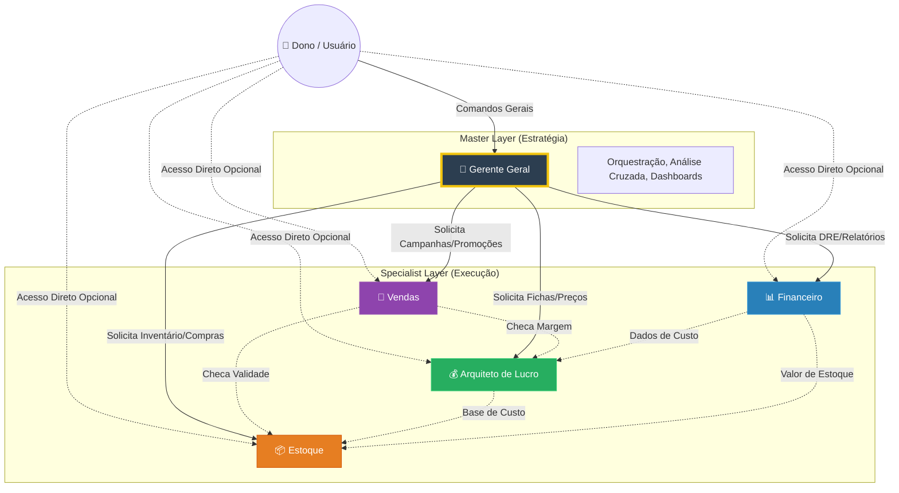

# Arquitetura do Squad CFO - Restaurante

## 🏛️ Hierarquia de Agentes

O Squad CFO opera em uma estrutura hierárquica clara para garantir que a estratégia (Gerente Geral) guie a execução (Especialistas).

## 📋 Responsabilidades por Agente

### 1. 👔 Gerente Geral (Master)
*   **Função:** Cérebro central. Não faz cálculos manuais, mas entende o todo.
*   **Superpoder:** Análise cruzada (ex: cruzar dados de estoque parado com necessidade de caixa).
*   **Outputs:** Dashboards estratégicos, planos de ação, resolução de conflitos.

### 2. 💰 Arquiteto de Lucro (Engenharia de Menu)
*   **Função:** Garante que cada prato vendido dê lucro.
*   **Tarefas:** Fichas técnicas, Precificação, Engenharia de Cardápio, Análise de CMV Teórico.

### 3. 📊 Financeiro (Controller)
*   **Função:** Cuida da saúde financeira da empresa (macro).
*   **Tarefas:** DRE (Demonstrativo de Resultados), Fluxo de Caixa, Contas a Pagar/Receber, Impostos.

### 4. 📦 Estoque (Operações)
*   **Função:** Garante que não falte nem sobre insumos.
*   **Tarefas:** Registro de Entradas/Saídas, Inventário, Par Stock, Controle de Validade (PVPS).

### 5. 🎯 Vendas (Growth & Revenue)
*   **Função:** Maximiza a receita e a ocupação.
*   **Tarefas:** Campanhas "Raspadinha", RevPASH (Ocupação), Promoções de itens prestes a vencer.
